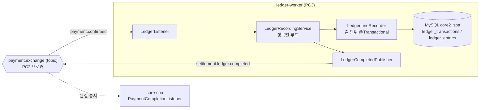

# ledger-worker

> core-spa가 발행하는 결제 확정 이벤트를 받아, 주문의 각 항목(판매자-상품 줄)을
> 복식부기 장부로 기록하고, 다 기록하면 완결 통지를 되쏘는 워커.
> 분산 결제 파이프라인([core-spa](https://github.com/BonuKoo/BookStore))의 구성요소.

---

## 기술 스택

| 구분 | 기술 |
| :--- | :--- |
| Language / Framework | Java 21, Spring Boot 3.4.8 |
| Messaging | RabbitMQ (Spring AMQP), Manual ACK, DLX/DLQ, Publisher Confirms |
| Persistence | Spring Data JPA, MySQL 8 |
| Build | Gradle |

---

## 흐름

같은 `payment.confirmed` 하나를 알림, 재고차감, 정산 워커가 각자 자기 큐로 받아 간다(topic 팬아웃).
이 워커가 맡은 건 장부다. 정산 워커가 판매자별로 금액을 합산하는 것과 달리, 장부는 항목을 줄 단위로
그대로 남긴다. 나중에 감사할 때 주문을 한 줄씩 되짚을 수 있어야 하기 때문이다.

---

## 메시지 계약

| 구분 | 값 |
| :--- | :--- |
| 구독 큐 | `ledger.recording.queue` (`payment.exchange` topic, routing key `payment.confirmed`) |
| 발행 라우팅키 | `settlement.ledger.completed` → `settlement.ledger.completed.queue` (core-spa가 소비) |
| DLX / DLQ | `payment.dlx` (direct) + `ledger.recording.queue.dlq`, `settlement.ledger.completed.queue.dlq` |
| 수신 페이로드 | `{ messageType, payload{ orderId, items[{ sellerId, productId, amount, quantity }] }, metadata }` |
| 발행 페이로드 | `{ payload: { orderId } }` |

프로듀서가 붙여 보내는 `__TypeId__` 헤더는 이 프로젝트에 없는 클래스를 가리키므로, 타입 매퍼를
`INFERRED`로 두고 `@RabbitListener` 파라미터 타입으로만 역직렬화한다. DLX와 DLQ 인자는 core-spa나
다른 워커가 선언한 값과 한 글자라도 다르면 안 된다. 다르면 RabbitMQ가 큐 재선언을 거부한다.

---

## 신뢰성과 정합성

리스너는 메시지를 직접 ack/nack 한다(auto-ack 아님). 성공하면 `basicAck`, 실패하면
`basicNack(requeue=false)`로 곧장 DLQ에 넣는다. 재전달이 무한히 도는 걸 막으려는 배선이다.

중복 전달은 `ledger_transactions(order_id, seller_id, product_id)` UNIQUE로 거른다. 흔한 경우는
사전 `exists` 확인으로 빠르게 쳐내고, 동시에 들어온 중복은 `saveAndFlush`가 던지는
`DataIntegrityViolationException`으로 잡는다. 같은 주문이 두 번 와도 분개는 한 번만 남는다.

항목은 줄마다 별도 트랜잭션으로 기록한다(`LedgerLineRecorder`). 각 줄이 독립된 회계 사실이라,
한 줄이 실패해도 이미 커밋된 다른 줄을 되돌릴 이유가 없다.

복식부기 불변식은 도메인 객체에 남겼다. 대변(REVENUE, CREDIT)과 차변(ITEM_BUYER, DEBIT)을
`DoubleLedgerEntry`가 짝지어 들고 있다.

`sellerId`가 빠진 메시지가 와도 죽지 않는다. 구버전 데이터가 이 필드를 안 채우고 올 때가 있어,
그런 항목은 `UNASSIGNED_SELLER_ID(0L)`로 귀속시킨다. 예전에 이 값이 null이라 라이브에서 NPE가 났었다.

완결 통지를 발행할 때는 publisher confirms와 returns 콜백으로 broker nack이나 unroutable을 로그에 남긴다.
