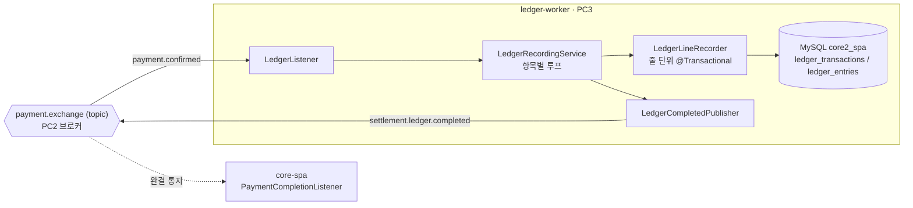

# ledger-worker

> core-spa의 **결제 확정 이벤트를 구독**해, 주문의 각 항목(판매자·상품 줄)을
> **복식부기 장부로 기록**하고, 기록이 끝나면 **완결 통지를 발행**하는 워커.
> 분산 결제 파이프라인([core-spa](https://github.com/BonuKoo/BookStore))의 구성요소

---

## 기술 스택

| 구분 | 기술 |
| :--- | :--- |
| Language / Framework | Java 21, Spring Boot 3.4.8 |
| Messaging | RabbitMQ (Spring AMQP) — Manual ACK · DLX/DLQ · Publisher Confirms |
| Persistence | Spring Data JPA, MySQL 8 |
| Build | Gradle |

---

## 흐름



한 건의 `payment.confirmed`를 알림·재고차감·정산 워커와 **독립적으로 팬아웃 소비**한다.
장부는 판매자별로 합산하지 않고 **항목 (판매자-상품) 단위로 감사 추적성**을 남기는 것이 정산 워커와의 설계 차이다.

---

## 메시지 계약

| 구분 | 값 |
| :--- | :--- |
| 구독 큐 | `ledger.recording.queue` (`payment.exchange` topic, routing key `payment.confirmed`) |
| 발행 라우팅키 | `settlement.ledger.completed` → `settlement.ledger.completed.queue` (core-spa가 소비) |
| DLX / DLQ | `payment.dlx` (direct) + `ledger.recording.queue.dlq`, `settlement.ledger.completed.queue.dlq` |
| 수신 페이로드 | `{ messageType, payload{ orderId, items[{ sellerId, productId, amount, quantity }] }, metadata }` |
| 발행 페이로드 | `{ payload: { orderId } }` |


프로듀서가 실어보내는 `__TypeId__` 헤더는 이 프로젝트에 없는 클래스라, 타입 매퍼를 `INFERRED`로 두어
`@RabbitListener` 파라미터 타입으로만 역직렬화한다. DLX/DLQ 인자는 core-spa·다른 워커의 선언과
**한 글자도 다르면 안 된다**

---

## 신뢰성 · 정합성 전략

- **Manual ACK** — 리스너가 성공 시 `basicAck`, 처리 실패 시 `basicNack(requeue=false)`로 즉시 DLQ 격리.
  무한 재전달 루프를 원천 차단한다.
- **멱등 소비** — `ledger_transactions(order_id, seller_id, product_id)` UNIQUE 위에
  사전 `exists` 확인 + `saveAndFlush` + `DataIntegrityViolationException` 방어의 이중 가드. 중복 전달돼도
  분개가 두 번 기록되지 않는다.
- **줄 단위 독립 트랜잭션** — `LedgerLineRecorder`가 항목 한 줄을 각각 `@Transactional`로 처리한다.
  한 줄은 독립적인 회계 사실이므로 다른 줄의 이미 커밋된 분개를 되돌리지 않는다.
- **복식부기 불변식** — 대변(REVENUE, CREDIT)과 차변(ITEM_BUYER, DEBIT)을 `DoubleLedgerEntry`로 명시.
- **null-safe sellerId** — 프로듀서가 `sellerId`를 못 채운 구버전 메시지도 크래시 없이
  `UNASSIGNED_SELLER_ID(0L)`로 귀속(과거 라이브 NPE의 근본 방어).
- **Publisher Confirms / Returns** — 완결 통지 발행 시 broker nack·unroutable을 콜백으로 관측.

---


## 로컬 실행

사전 조건: PC2 RabbitMQ(`192.168.0.6:5672`, vhost `core_vhost`)와 MySQL `core2_spa`가 떠 있어야 한다.

```bash
# 1) 장부 스키마 + 계정 과목 시드 (accounts에 REVENUE / ITEM_BUYER 필수)
mysql -u root -p core2_spa < docs/ddl/ledger.sql

# 2) 워커 기동 (기본 포트 8083)
./gradlew bootRun
```

접속 정보는 `src/main/resources/application.yml`에 있다. PC3 배포 시 datasource URL을
PC1 LAN IP(`192.168.0.5`)로 바꿔야 하며, MySQL 원격 접속 허용(bind-address/권한)이 선행돼야 한다.

```bash
# 헬스체크
curl http://localhost:8083/actuator/health
```

---

## 테스트

```bash
./gradlew test
```

`LedgerRecordingServiceIntegrationTest`(다중 항목 독립 기록 / 빈 items / 중복 전달 멱등),
`LedgerLineRecorderIntegrationTest`가 MySQL 연결을 전제로 계약을 검증한다.

---

## 프로젝트 구조

```
src/main/java/com/bookService/ledger
├── config/RabbitMqConfig.java        # exchange·큐·DLX·Manual ACK 팩토리·타입 매퍼
├── listener/LedgerListener.java      # 구독 → 위임 → 완결 발행 → ack/nack
├── service/
│   ├── LedgerRecordingService.java   # 항목 루프 오케스트레이션
│   └── LedgerLineRecorder.java       # 줄 단위 복식부기 @Transactional
├── publisher/LedgerCompletedPublisher.java
├── domain/                           # Account, LedgerTransaction, LedgerEntry, DoubleLedgerEntry ...
├── repository/                       # JPA 리포지토리 (멱등 exists 쿼리 포함)
└── dto/                              # PaymentEventMessage(수신) / LedgerCompletedMessage(발행)
docs/ddl/ledger.sql                   # 테이블 + 계정 과목 시드
```
