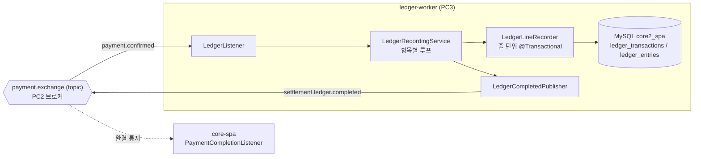

# ledger-worker

> core-spa가 발행하는 결제 확정 이벤트를 받아, 주문의 각 항목(판매자-상품 줄)을
> 복식부기 장부로 기록하고, 다 기록하면 완결 통지를 되쏘는 워커.
> 분산 결제 파이프라인([core-spa](https://github.com/BonuKoo/BookStore))의 구성요소.

---

## 기술 스택

| 구분 | 기술 |
| :--- | :--- |
| Language / Framework | Java 21, Spring Boot 3.4.8 |
| Messaging | RabbitMQ (Spring AMQP), Manual ACK, DLX/DLQ, Publisher Confirms |
| Persistence | Spring Data JPA, MySQL 8 |
| Build | Gradle |

---

## 흐름

`payment.confirmed` 하나가 나가면 알림, 재고차감, 정산, 장부 워커가 각자 자기 큐로 받아 간다(topic 팬아웃).
이 워커는 장부 담당이다. 정산은 판매자별로 금액을 묶지만, 장부는 안 묶는다. 항목 한 줄이 곧 분개 한 건이고,
감사할 땐 그 줄을 그대로 되짚어야 한다.

---

## 메시지 계약

| 구분 | 값 |
| :--- | :--- |
| 구독 큐 | `ledger.recording.queue` (`payment.exchange` topic, routing key `payment.confirmed`) |
| 발행 라우팅키 | `settlement.ledger.completed` → `settlement.ledger.completed.queue` (core-spa가 소비) |
| DLX / DLQ | `payment.dlx` (direct) + `ledger.recording.queue.dlq`, `settlement.ledger.completed.queue.dlq` |
| 수신 페이로드 | `{ messageType, payload{ orderId, items[{ sellerId, productId, amount, quantity }] }, metadata }` |
| 발행 페이로드 | `{ payload: { orderId } }` |

## RabbitMQ 메시지 처리 및 설정 유의사항

> ⚠️ 메시지 타입 역직렬화 전략
>
> `__TypeId__` 헤더는 프로듀서 기준의 타입 정보를 포함하며,
> 컨슈머에서는 해당 값을 직접 매핑하지 않고 자체 DTO를 기준으로 메시지를 해석한다.
>
> 이를 위해 컨슈머는 타입 매퍼를 `INFERRED` 모드로 설정하고,
> `@RabbitListener` 메서드의 파라미터 타입을 기준으로 메시지를 역직렬화한다.
>
> 이 설계는 다음과 같은 목적을 가진다:
>
> - 서비스 간 DTO 공유 없이 독립적인 개발 및 배포 가능
> - 메시지 스키마 변경에 대한 유연한 대응
> - 헤더 기반 타입 매핑에 대한 의존성 제거를 통한 느슨한 결합 유지

> ⚠️ Queue/DLX/DLQ 설정은 모든 서비스에서 동일해야 하며,
> 불일치 시 RabbitMQ가 큐 재선언을 거부한다.
